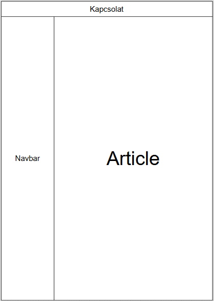
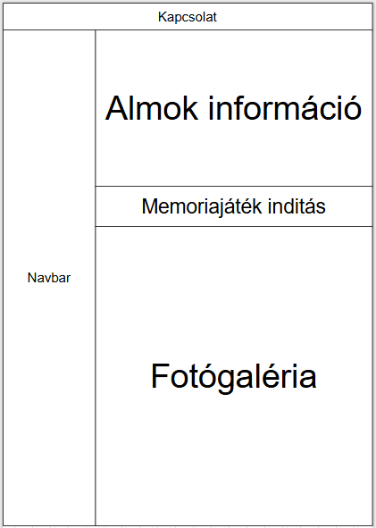

# Little Goblins Tenyészet

# Részletes leírás:

## Navbar 
- 2 gomb; Kezdőlap és Almokra
- Chatbot bal alul

## Kezdőlap:
- Statikus weboldal, információk a kennellel kapcsolatban.

## Almok
- fotógaléria elemei macska kártyák, amin név is van
- képes a macska dorombolni, ha mozgásban van az egér.
- fotógaléria felett egy memoriajáték jelenlegi alomról

## UML ábrák

## Egyéb funkciók
### fejlécben mini navbar és kapcsolat: facebook, messenger.
### chatbot, ezen belül elérhető GY.I.K, fordítás más nyelvekre
### [Neko](https://github.com/crgimenes/neko) 

# Projektirányelvek
> - A projekt feladatok `issue`-ként kerülnek kezelésre.
> - UML diagramok készítéséhez `draw.io`-t használunk.
> - A repository tartalmaz `.gitignore` fájlt.
> - A drótvázak a `README`-ben találhatóak.
> - A projekt `dokumentációja` `magyar` nyelvű.
> - A `forráskódon` belüli elnevezések és kommentek `angol` nyelvűek.
> - A `fájl és könyvtárstruktúra` elnevezései `angol` nyelvűek.

# Fejlesztési konvenciók
> - A változó, függvény és fájlnevek `snake_case` formátumot követnek.
> - Osztálynevek `PascalCase`.
> - Konstansok `nagybetűsek`.
> - A kód formázásához `Prettier` használata kötelező.
> - Függvények egy felelősségi körrel rendelkezzenek.

>> Fejlesztői dokumentáció külön kódból generált dolog
