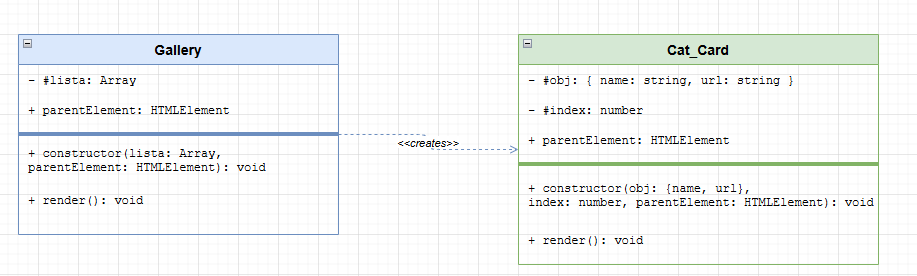

# Little Goblins Tenyészet

## Kezdőlap:
- Statikus weboldal, információk a kennellel kapcsolatban.
  

## Navbar 
- 3 gomb; Kezdőlap, Almok, Macskaváltó™
- Chatbot bal alul
## Almok

- fotógaléria elemei macska kártyák, amin név is van
- képes a macska dorombolni, ha mozgásban van az egér.
- fotógaléria felett egy memóriajáték jelenlegi alomról

### Galéria osztályok
- `Cat_Card`
  > Egy macskának a megjelenítését kezeli.
- `Gallery`
  > Példányosítja a `Cat_Cardokat` és a galleryben megjeleníti a `gallery_cat_list` tartalma alapján.
- `gallery_cat_list`
  > Tárolja a macskák nevét, és elérési útvonalát.
  
### Memóriajáték osztályok
- `Memory_Card`
  > Egy memóriakártya megjelenítése.
- `Memory_Renderer`
  > Memóriakártyák megjelenítése.
- `Memory_Deck`
  > Memóriajáték logikájának kezelése. 
- `memory_cat_list`
  > Tárolja a macskák nevét, és elérési útvonalát.

## UML ábrák

## Egyéb funkciók
### fejlécben mini navbar és kapcsolat: facebook, messenger.
### chatbot, ezen belül elérhető GY.I.K, fordítás más nyelvekre
---
## [Neko](https://github.com/crgimenes/neko)
### Macskaváltó™
> Megváltoztatja Neko kinézetét rózsaszín vagy szürkére.

# Projektirányelvek
>
> - A projekt feladatok `issue`-ként kerülnek kezelésre.
> - UML diagramok készítéséhez `draw.io`-t használunk.
> - A repository tartalmaz `.gitignore` fájlt.
> - A drótvázak a `README`-ben találhatóak.
> - A projekt `dokumentációja` `magyar` nyelvű.
> - A `forráskódon` belüli elnevezések és kommentek `angol` nyelvűek.
> - A `fájl és könyvtárstruktúra` elnevezései `angol` nyelvűek.

# Fejlesztési konvenciók
>
> - A változó, függvény és fájlnevek `snake_case` formátumot követnek.
> - Osztálynevek `PascalCase`.
> - Konstansok `nagybetűsek`.
> - A kód formázásához `Prettier` használata kötelező.
> - Függvények egy felelősségi körrel rendelkezzenek.

>> Fejlesztői dokumentáció külön kódból generált dolog
